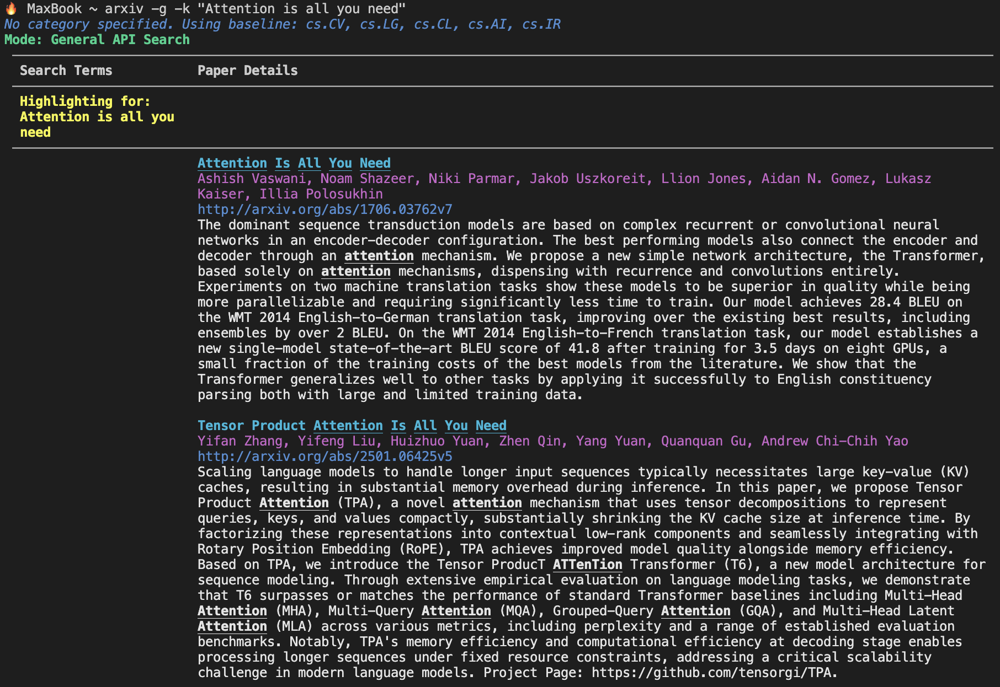
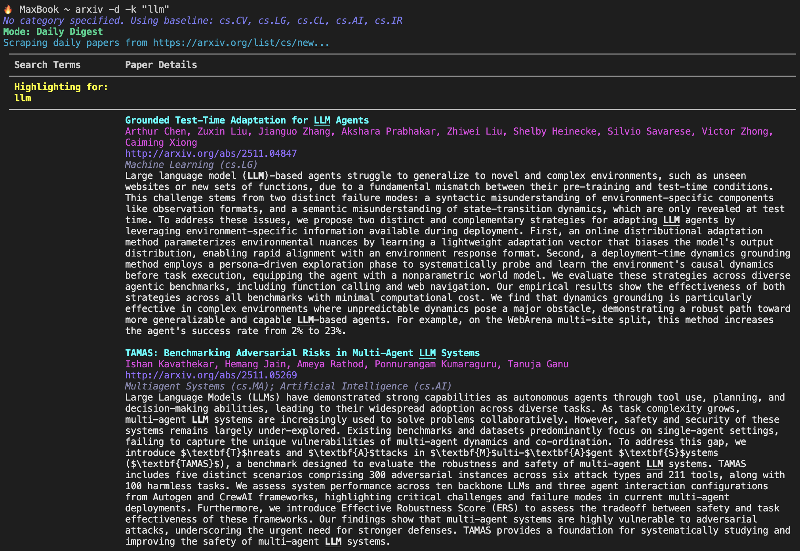

# ArXiv Paper Scraper

This project provides an easy-to-use command-line tool to search, fetch, and filter academic papers directly from arXiv in your terminal.

The primary tool, `arxiv`, operates in two distinct modes: a **general search** mode for querying the entire historical arXiv database, and a **daily digest** mode for scraping and filtering the very latest papers.

_A side-by-side comparison of the General Search (`-g`) and Daily Digest (`-d`) modes._

| General Search (`-g`) Example                | Daily Digest (`-d`) Example                    |
| :-------------------------------------------: | :---------------------------------------------: |
|  |  |

## Table of Contents

- [Prerequisites](#prerequisites)
- [Installation and Setup](#installation-and-setup)
- [Usage: The Unified `arxiv` Command](#usage-the-unified-arxiv-command)
  - [Mode 1: General Search (`-g`)](#mode-1-general-search--g)
  - [Mode 2: Daily Digest (`-d`)](#mode-2-daily-digest--d)
- [Optional Workflow: Local Email Parsing (macOS)](#optional-workflow-local-email-parsing-macos)
- [Key Files](#key-files)
- [Acknowledgements](#acknowledgements)
- [Contributing](#contributing)
- [Disclaimer](#disclaimer)

## Prerequisites

- **Python 3** installed.
- For the email workflow (`-m mode`): **macOS** with the native **Apple Mail app**.

## Installation and Setup

This single setup process will configure the `arxiv` command and all its features.

### Step 1: Clone the Repository and Set Up Environment

```bash
# Clone this repository
git clone https://github.com/Maximeswd/ArXiv-Scraper.git
cd ArXiv-Reader

# Create and activate a Python virtual environment
python3 -m venv .venv
source .venv/bin/activate

# Install the required packages
pip install -r requirements.txt
```
> ⚡ **Pro Tip:** For faster installation, consider using `uv` (`pip install uv`, then `uv pip install -r requirements.txt`).

### Step 2: Create the `arxiv` Terminal Command

This step creates a convenient `arxiv` command that you can run from anywhere in your terminal.

1.  Open your Zsh configuration file:
    ```bash
    open ~/.zshrc
    ```
    2.  Add the following function to the end of the file. **Remember to replace `/path/to/your/ArXiv-Reader` with the absolute path to where you cloned the project.**

    ```zsh
    # ===== ArXiv Reader Tool =====
    # A powerful function to search arXiv from the command line.
    # Mode must be specified first: -g (general) or -d (daily).
    arxiv() {
      # Validate that a mode flag is provided first.
      if [[ "$1" != "-g" && "$1" != "-d" ]]; then
        echo -e "\n\x1b[1;31mError:\x1b[0m You must specify a mode as the first argument."
        echo -e "  \x1b[1;34m-g\x1b[0m : General Search (entire database)"
        echo -e "  \x1b[1;32m-d\x1b[0m : Daily Digest (today's papers)"
        echo -e "\n\x1b[33mExample:\x1b[0m arxiv -d -k transformer -c cs.CV --max 5\n"
        return 1
      fi

      # Activate venv, run the script with all arguments, then deactivate.
      source /path/to/your/ArXiv-Reader/.venv/bin/activate
      python /path/to/your/ArXiv-Reader/arxiv_cli.py "$@"
      deactivate
    }
    ```
3.  Save the `.zshrc` file and reload your terminal session to activate the command:
    ```bash
    source ~/.zshrc
    ```

## Usage: The Unified `arxiv` Command

The `arxiv` command is your single entry point. The first argument you provide **must** be the mode: `-g` for a general search or `-d` for the daily digest.

> **A Note on Highlighting:** The tool automatically highlights individual words from your `-k` (keyword) and `-a` (author) queries. It splits phrases (like `"Attention is all you need"`) and only highlights **whole word matches** in the output for clarity.

> **A Note on Relevance Sorting:** To ensure the most important papers appear first, results are sorted by relevance when keywords are used.
> - **Daily Mode (`-d`):** Results are sorted by a custom relevance score. This score is calculated from the normalized frequency (keyword count / total words) of your keywords, with the score from the **title given 2x more weight** than matches in the abstract.
> - **General Mode (`-g`):** Results are sorted using the arXiv API's powerful, built-in relevance engine, which is highly optimized for academic papers.


## A Note for macOS Users: Use iTerm2

For the best visual experience and full functionality, it is **highly recommended** to use [iTerm2](https://iterm2.com/) instead of the default `Terminal.app` on macOS.

The built-in Terminal app is outdated and does not support modern features like true hyperlinks or clean underline rendering. This can result in:
-   Needing to `Cmd + Double Click` links instead of a simple `Cmd + Single Click`.
-   Visual glitches where underlines stretch across the screen or bleed onto other lines.

**iTerm2 is a free, modern terminal that solves all these issues.** The `arxiv` command will work exactly the same, but the output will look better and the links will be single-clickable.

**Installation is simple with Homebrew:**
```bash
brew install --cask iterm2
```

---

### Mode 1: General Search (`-g`)

This mode uses the official arXiv API to search the **entire historical database**. It is perfect for finding foundational papers or researching a topic across any time period.

#### **Key Features:**
-   **Relevance Sorting:** Automatically sorts results by relevance when using keywords, ensuring the most important papers appear first.
-   **Date Filtering:** Search for papers submitted within a specific date range.
-   **Comprehensive Search:** Query by keyword, author, category, or any combination.
-   **High Volume:** Fetch up to 2,000 results in a single query with the `--all` flag.

#### **Examples:**

**Search by keyword to find a specific paper:**
```bash
# Finds the original "Attention Is All You Need" paper, sorted to the top
arxiv -g -k "Attention is all you need" --max 5
```

**Find all papers by an author within a date range:**
```bash
# Find papers by "Yann LeCun" submitted in 2025
arxiv -g -a "Yann LeCun" --start-date 2025-01-01 --end-date 2025-12-31
```

---

### Mode 2: Daily Digest (`-d`)

This mode scrapes the live `cs/new` webpage to give you an up-to-the-minute view of **today's latest computer science papers**. It is designed for quickly filtering the daily firehose of new research.

#### **Key Features:**
-   **Real-Time:** Gets the newest papers as they are listed.
-   **Relevance Sorting:** Automatically ranks papers by keyword density, showing the most relevant results first.
-   **Smart Filtering:** Filters by keyword (in title/abstract), author, and specific CS categories.
-   **Baseline Categories:** If you don't specify `-c`, it automatically uses a baseline: **`cs.CV`, `cs.LG`, `cs.CL`, `cs.AI`, and `cs.IR`**.
-   **Broad Search:** Use `-c cs.*` to include *all* computer science categories.
-   **Fetch All:** Use the `--all` flag to get every matching paper from the day's listings.

#### **Examples:**

**Search for a keyword using the baseline categories:**
```bash
# Finds today's papers on "llm" in key AI fields, sorted by relevance
arxiv -d -k "llm"
```

**Get ALL of today's papers by an author across ALL CS fields:**
```bash
# See if "Geoffrey Hinton" published anything new today in any CS field
arxiv -d -c cs.* -a "Geoffrey Hinton" --all
```

> **Note:** Use the `--max` flag to limit the number of results, or use the `--all` flag to retrieve all matching papers from the daily page.

### Mode 3 (Optional): Email Parser (`-m`) 

This workflow is for users who prefer to work offline by parsing the daily arXiv email digest that has been downloaded to their local Apple Mail app. You can now use the `-m` mode to parse your emails. You can optionally use `--fetch N` to tell the tool to go get the `N` most recent emails before parsing.

#### **Examples:**

**1. Fetch the single most recent email and search it (Default):**
```bash
# Fetches the latest email, then searches for "transformer"
arxiv -m --fetch -k "transformer"
```

**2. Fetch the last 3 emails:**
```bash
# Fetches the 3 most recent emails and looks for "Hinton"
arxiv -m --fetch 3 -a "Hinton"
```

**3. Parse the existing file without fetching:**
If you have already fetched the emails and just want to re-run a search on the local file:
```bash
arxiv -m -k "LLM"
```

### Step 1: Subscribe to arXiv Daily Emails

Ensure you are subscribed to receive the daily arXiv emails. You can find instructions on the [arXiv help page](https://info.arxiv.org/help/subscribe.html).

### Step 2: Create the Email Fetch Script (`fetch_arxiv.scpt`)

This AppleScript tells your Mail app to find the latest arXiv email and save its content to a text file (`mail_text.txt`).

1.  Open the **Script Editor** app on your Mac.
2.  Paste the following code, **editing the `outputPath`** to point to a `mail_text.txt` file inside your project folder.

    ```applescript
    use AppleScript version "2.4"
    use scripting additions

    on run argv
        set fetchCount to 1
        if (count of argv) > 0 then
            try
                set fetchCount to (item 1 of argv) as integer
            end try
        end if

        set outputPath to "/path/to/your/ArXiv-Reader/mail_text.txt"
        set targetAccountName to "<Your Account Description>" -- e.g. "Gmail"
        set targetMailboxName to "INBOX"

        set fullContent to ""
        set delimiter to "
    %%%---%%%---%%%---%%%---%%%---%%%---%%%---%%%---%%%---%%%---%%%---%%%---%%%---
    "

        tell application "Mail"
            try
                -- 1. Check for new mail
                check for new mail for account targetAccountName
                
                if not (account targetAccountName exists) then
                    return "Error: Account not found."
                end if
                
                -- 2. Fetch all matching messages
                set foundMessages to (messages of mailbox targetMailboxName of account targetAccountName whose sender contains "no-reply@arXiv.org" and subject contains "cs daily")
                set totalFound to count of foundMessages
                
                if totalFound = 0 then
                    return "No matching emails found."
                end if
                
                -- 3. Sort messages by date (Newest First)
                repeat with i from 1 to totalFound - 1
                    repeat with j from 1 to totalFound - i
                        if (date received of item j of foundMessages) < (date received of item (j + 1) of foundMessages) then
                            set temp to item j of foundMessages
                            set item j of foundMessages to item (j + 1) of foundMessages
                            set item (j + 1) of foundMessages to temp
                        end if
                    end repeat
                end repeat
                
                -- 4. Determine how many to read
                set loopLimit to fetchCount
                if loopLimit > totalFound then
                    set loopLimit to totalFound
                end if
                
                -- 5. Concatenate content
                repeat with k from 1 to loopLimit
                    set thisMsg to item k of foundMessages
                    set fullContent to fullContent & (content of thisMsg) & delimiter
                end repeat
                
            on error errMsg
                return "Mail App Error: " & errMsg
            end try
        end tell

        if fullContent is "" then
            return "No content extracted."
        end if

        try
            set theFile to open for access (POSIX file outputPath) with write permission
            set eof of theFile to 0
            write fullContent to theFile as «class utf8»
            close access theFile
            return "Success: Fetched " & loopLimit & " emails."
        on error errMsg
            return "File Write Error: " & errMsg
        end try
    end run
    ```
3.  Save the script inside your project folder as `fetch_arxiv.scpt`.

### Step 3: Add and use the -m mode

1.  Add this additional function to your `~/.zshrc` file:
    ```zsh
    # ===== ArXiv Scraper Tool =====
    # Mode must be specified first: -g (general), -d (daily), or -m (mail).
    arxiv() {
      # Validate that a mode flag is provided first.
      if [[ "$1" != "-g" && "$1" != "-d" && "$1" != "-m" ]]; then
        echo -e "\n\x1b[1;31mError:\x1b[0m You must specify a mode as the first argument."
        echo -e "  \x1b[1;34m-g\x1b[0m : General Search (entire database)"
        echo -e "  \x1b[1;32m-d\x1b[0m : Daily Digest (scrape website)"
        echo -e "  \x1b[1;35m-m\x1b[0m : Mail Parser (macOS Apple Mail)"
        echo -e "\n\x1b[33mExample:\x1b[0m arxiv -d -k transformer\n"
        return 1
      fi

      # Use a subshell to keep the main shell environment clean
      (
        cd "/path/to/your/ArXiv-Scraper" || { echo "Error: Project directory not found."; return 1; }
        
        source .venv/bin/activate
        
        # If mail mode is selected, run the AppleScript first
        if [[ "$1" == "-m" ]]; then
          echo "Fetching latest arXiv email from Apple Mail..."
          osascript fetch_arxiv.scpt
        fi
        
        # Run the single, unified Python script with all original arguments
        python arxiv_cli.py "$@"
      )
    }
    ```
2.  Reload your terminal with `source ~/.zshrc`.
3.  Sync your Mail app, then run the command:
    ```bash
    # Search for a keyword in your latest email
    arxiv -m -k "transformer"

    # Search for an author in your latest email
    arxiv -m -a "Geoffrey Hinton"
    ```


## Key Files

-   **`arxiv_cli.py`**: The core, unified script that powers the `arxiv` command and all its modes.
-   **`utils.py`**: A helper script for styling and highlighting the terminal output.
-   **`requirements.txt`**: Lists all necessary Python packages.
-   **`fetch_arxiv.scpt`**: (For email workflow) The AppleScript to extract email content.
-   **`mail_text.txt`**: The intermediate file where email content is stored (auto-generated).

## Acknowledgements

The local email file parsing logic is based on the original work by **ege-erdogan**. The original repository can be found at: [https://github.com/ege-erdogan/yet-another-arxiv-filter](https://github.com/ege-erdogan/yet-another-arxiv-filter).

## Contributing

Feedback and contributions are welcome. Please feel free to open an issue or submit a pull request.

## Disclaimer

This tool relies on pattern matching and external data sources which may change or fail without notice. While it aims to assist in filtering the literature, it does not guarantee a perfect signal or an exhaustive search. The maintainers accept no liability for any overlooked citations, scooped ideas, or incomplete literature reviews resulting from the use of this tool. Please verify all critical searches directly on the official arXiv website.

## 📚 Cite this Repository
If you use ArXiv Paper Scraper in your research or projects, please cite it as follows:

```cite
@software{dassen2025arxivscraper,
  author       = {Maxime Dassen},
  title        = {ArXiv Paper Scraper: A Unified CLI Tool for Searching and Filtering Academic Papers from arXiv},
  year         = {2025},
  url          = {https://github.com/Maximeswd/ArXiv-Scraper},
  version      = {1.0.0},
  license      = {MIT}
}
```

Or as follows:

```cite
Dassen, M. (2025). ArXiv Paper Scraper: A Unified CLI Tool for Searching and Filtering Academic Papers from arXiv. GitHub. Available at: https://github.com/Maximeswd/ArXiv-Scraper
```