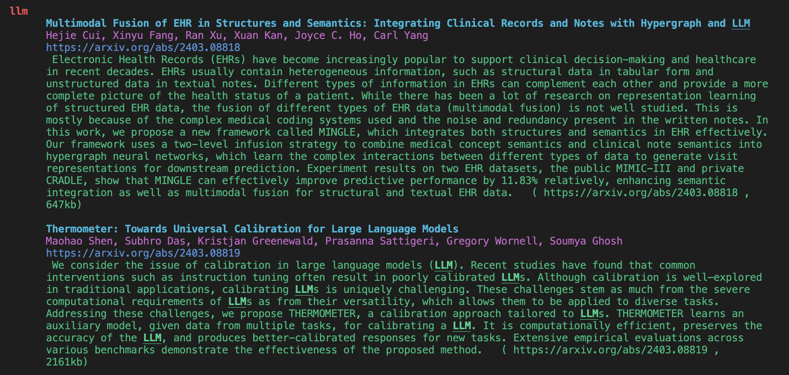

# Yet Another arXiv Filter (Enhanced for macOS)

This is an adjusted version of the original "Yet Another arXiv Filter", a hacky but effective keyword/author search through daily arXiv emails.

> **Citation:** This project is a modification of the original work by **ege-erdogan**. The original repository can be found at: [https://github.com/ege-erdogan/yet-another-arxiv-filter](https://github.com/ege-erdogan/yet-another-arxiv-filter).

This version adds some adjustments for a streamlined and automated workflow on macOS:
1.  **Full Automation:** An AppleScript automatically fetches the latest daily arXiv email from your Apple Mail app, removing the need for manual copy-pasting.
2.  **Interactive Command-Line Arguments:** The Python script has been upgraded with `argparse` to accept keywords and authors directly from the terminal for on-the-fly searches.
3.  **Powerful Terminal Command:** A Zsh function (`arxiv`) replaces the simple alias, allowing for a single, powerful command that handles both email fetching and argument-based filtering.

_Example of the terminal output after running the arXiv filter._


## Table of Contents

- [Prerequisites](#prerequisites)
- [Installation and Setup](#installation-and-setup)
- [Usage](#usage)
- [Key Files](#key-files)
- [Contributing](#contributing)
- [Disclaimer](#disclaimer)

## Prerequisites

- A **MacBook** running macOS.
- **Python 3** installed.
- The native **Apple Mail** app configured with the email account that receives your arXiv subscription.

## Installation and Setup

Follow these steps to get the fully automated system running.

### Step 1: Subscribe to arXiv Daily Emails

First, ensure you are receiving the daily arXiv emails. You need to send a specially formatted **plain text** email.

- **To:** `cs@arXiv.org` (or another archive like `physics@arxiv.org`)
- **Subject:** `subscribe Your Full Name`
- **Body:** Add the subject classes you're interested in, one per line.

**Example for AI/ML/CV/NLP:**
```
add LG
add CL
add CV
add AI
add IR
add NE
```

### Step 2: Clone the Repository

Open your terminal and clone this repository to your local machine.
```bash
git clone <repository_url>
cd <repository_folder_name>
```

### Step 3: Set Up Python Environment

It's best practice to use a virtual environment.

```bash
# Create a virtual environment
python3 -m venv .venv

# Activate it
source .venv/bin/activate

# Install the required packages from requirements.txt
pip install -r requirements.txt
```

> ⚡ **Pro Tip: Faster Installation with `uv`**
> For a significantly faster installation, you can use `uv`, a next-generation Python package installer. First, install it with `pip install uv`, then you can use `uv pip install -r requirements.txt` as a lightning-fast, drop-in replacement for the `pip` command. You can use it for any other packages you might add later as well.

### Step 4: Create the Automation Script (AppleScript)

This script will tell your Mail app to find the latest arXiv email and save it for processing.

1.  Open the **Script Editor** app on your Mac (in `Applications > Utilities`).
2.  Paste the following code into a new script window:

    ```applescript
    -- Set the path where you want to save the email content.
    -- IMPORTANT: You MUST change this path to match your own.
    set outputPath to "/path/to/your/ArXiv-Reader/mail_text.txt"

    tell application "Mail"
        set theMessages to (messages of inbox whose sender is "noreply@arxiv.org" and subject contains "cs daily")
        if (count of theMessages) is 0 then
            return "No new arXiv email found."
        end if
        set theMessage to the last item of theMessages
        set theContent to the content of theMessage
        try
            set theFile to open for access file outputPath with write permission
            set eof of theFile to 0
            write theContent to theFile starting at eof
            close access theFile
            return "Successfully saved arXiv email."
        on error
            close access file outputPath
            return "Error writing to file."
        end try
    end tell
    ```

3.  **Crucially, edit the `outputPath`** to the absolute path of the `mail_text.txt` file inside your project folder.
    > **Tip:** In your terminal, navigate to the project folder and run `pwd` to get the path. Then append `/mail_text.txt` to it.

4.  Save the script (`File > Save`) inside your project folder with the name `fetch_arxiv.scpt`.

### Step 5: Create the Terminal Command (Zsh Function)

This function will tie everything together into a single `arxiv` command.

1.  Open your Zsh configuration file in a text editor:
    ```bash
    open ~/.zshrc
    ```
2.  Add the following function to the end of the file. **Remember to replace the two instances of `/path/to/your/ArXiv-Reader` with your actual project path.**

    ```bash
    # Function to automatically fetch the latest arXiv email and filter it
    arxiv() {
      # Change to the correct directory
      cd /path/to/your/ArXiv-Reader
      
      # Run the AppleScript to get the latest email and save it
      osascript /path/to/your/ArXiv-Reader/fetch_arxiv.scpt >/dev/null 2>&1
      
      # Run the Python filter, passing along any arguments you provided
      python arxiv_filter.py "$@"
    }
    ```
3.  Save the `.zshrc` file and close the editor.
4.  Activate the new command in your current terminal session:
    ```bash
    source ~/.zshrc
    ```

## Usage

The `arxiv` command is now ready to use directly in your terminal. It operates in two modes.

> **Note:** To get the absolute latest papers, open your Apple Mail app and click the "Get Mail" icon to sync your inbox before running the command.

### Mode 1: Interactive Search (Using Command-Line Arguments)

Provide keywords or authors directly. This will ignore the `.txt` files. Remember to wrap phrases with spaces in quotes.

**Search by Keyword(s):**
```bash
# Search for the phrase "graph neural network"
arxiv -k "graph neural network"

# Search for papers about RAG or multimodal
arxiv -k "RAG" "multimodal"
```

**Search by Author(s):**
```bash
# Search for papers by "Yann LeCun"
arxiv -a "Yann LeCun"

# Search for papers by Yann LeCun or Geoffrey Hinton
arxiv -a "Yann LeCun" "Geoffrey Hinton"
```

**Search by Both Keyword and Author:**
```bash
arxiv -k "transformer" -a "Ashish Vaswani"
```

### Mode 2: Default Search (Using Local Files)

If you run the command with **no arguments**, it will fall back to using the `keywords.txt` and `authors.txt` files for its search terms.

1.  Fill `keywords.txt` and `authors.txt` (one per line).
2.  Run the command:
    ```bash
    arxiv
    ```

### Advanced Usage: Getting Real-Time Results from the Website

For moments when you can't wait for the daily email, you can get papers the instant they are released on the arXiv website.

1.  Go to the arXiv "new" page for your field, for example: [https://arxiv.org/list/cs/new](https://arxiv.org/list/cs/new)
2.  Manually copy the content from that webpage.
3.  Manually paste the copied content into your `mail_text.txt` file.

**Important:** This manual process bypasses the email automation. Your `arxiv` command will not work as intended because it tries to fetch from the Mail app. Instead, you must run the python script directly:

```bash
# Make sure you are in the right directory first!
cd /path/to/your/ArXiv-Reader

# Run the script with specific arguments
python arxiv_filter.py -k "your keyword"

# Or run it with no arguments to use the .txt files
python arxiv_filter.py
```

## Key Files

-   **`arxiv_filter.py`**: The main Python script, now enhanced to accept command-line arguments.
-   **`fetch_arxiv.scpt`**: The AppleScript that automates fetching the email from your Mail app. This file is specific to your local machine.
-   **`requirements.txt`**: Lists the necessary Python packages for easy installation.
-   **`keywords.txt` / `authors.txt`**: Your default, persistent list of search terms.
-   **`.gitignore`**: Tells Git to ignore local-only files like your fetch script and user data.

## Contributing

Any feedback is welcome.

## Disclaimer

The author(s) of this repository are not responsible for any potential loss of career opportunities due to missed arXiv papers. Use at your own risk.
